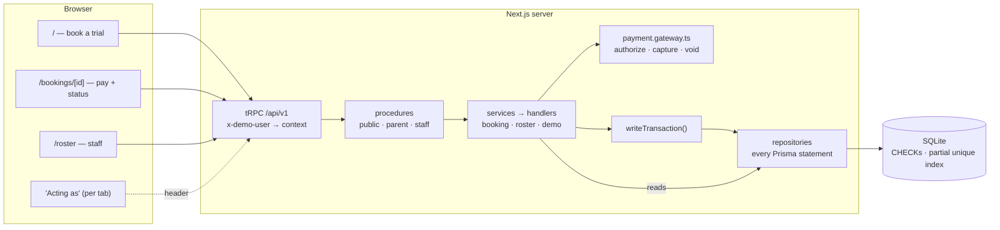
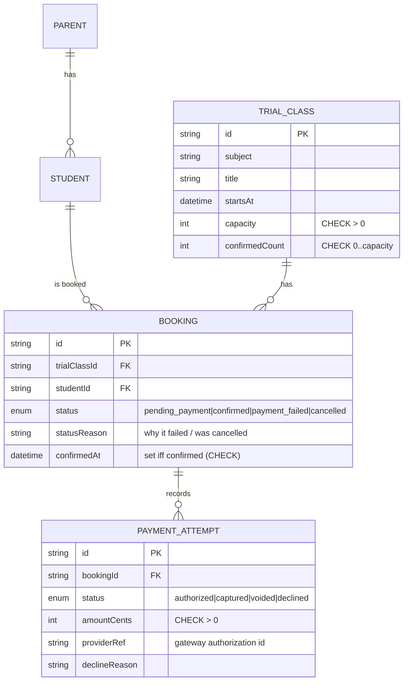
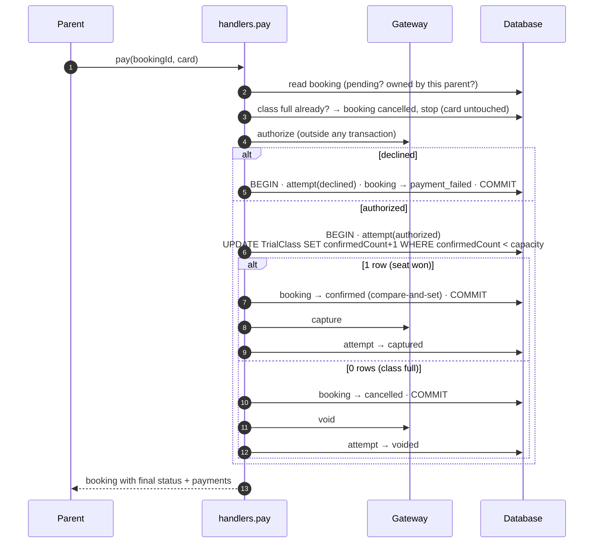

# Architecture

The README has the summary. This document covers the reasoning: the components, the schema and its constraints, the booking and payment state machines, how the last-seat race is decided, what happens when something fails, and how this moves to Postgres.

---

## 1. Principles

1. **The database enforces the invariants.** Capacity and "one active booking per child per class" are an atomic statement plus constraints (`CHECK`, a partial unique index), not only application checks. Tests write to the database directly to prove it.
2. **No lock is held across a network call.** The card gateway is always called outside transactions, and every transaction is short and starts with a write.
3. **Money only moves for a seat that was won.** Cards are authorized, and captured only after the seat is claimed; losers are voided.
4. **Outcomes are states, not errors.** A declined card or a lost seat ends the booking as `payment_failed` / `cancelled`. Only rule violations (duplicate, not your child, full at checkout) are errors.
5. **Zero-setup review.** SQLite in a file, migrations applied by `npm run setup`, tests and scripts on throwaway databases.

---

## 2. Components



- **Procedures** (`src/server/trpc.ts`): `publicProcedure`, `parentProcedure` (the `x-demo-user` must be a known parent → `ctx.parentId`), and `staffProcedure`. A middleware maps `DomainError`s thrown by handlers to tRPC codes, and so to HTTP statuses.
- **Layers per feature slice** (the boilerplate standard, see [folder-structure.md](folder-structure.md)): `*.schema.ts` (Zod) → `*.repository.ts` (every Prisma statement, with the client injected so it also runs inside a transaction) → `*.handlers.ts` (business logic, called directly by the tests and scripts) → `*.service.ts` (procedures, wrapping results in `apiResponse()`) → `*.router.ts`.
- **`writeTransaction()`** is the only way to write (§6).

---

## 3. Data model



Design choices:
- **Bookings belong to the child.** The paying parent is `student.parent`, so there is no `Booking.parentId` that could disagree with it.
- **One booking row per attempt.** A retry after a decline is a new row, so every booking's state machine only moves forward and history is kept. Duplicates are prevented by a *partial* unique index over active bookings only:
  ```sql
  CREATE UNIQUE INDEX "Booking_one_active_per_child_class" ON "Booking"("trialClassId", "studentId")
    WHERE status IN ('pending_payment', 'confirmed');
  ```
  It's declared in `prisma/schema/booking.prisma` with Prisma 7.10's `partialIndexes` preview feature.
- **A seat counter with a database bound.** `TrialClass.confirmedCount` is what the seat claim increments:
  ```sql
  CONSTRAINT "TrialClass_confirmedCount_check" CHECK ("confirmedCount" >= 0 AND "confirmedCount" <= "capacity")
  ```
  Prisma can't express `CHECK`s, so they are hand-written in `prisma/migrations/…_init/migration.sql` (marked `-- invariant:`), along with status CHECKs and `(status = 'confirmed') = (confirmedAt IS NOT NULL)`.
- **Payment attempts are append-only records** of what happened at the gateway.

---

## 4. State machines

**Booking**

```
pending_payment ──► confirmed        authorized + seat claimed (payment captured)
pending_payment ──► payment_failed   card declined (nothing charged)
pending_payment ──► cancelled        class full before paying (card untouched) or seat lost during payment (authorization voided)
```
All three end states are terminal. Every transition is a compare-and-set (`UPDATE … WHERE id = ? AND status = 'pending_payment'`), so two concurrent requests can't both move the same booking.

**PaymentAttempt:** `authorized → captured | voided`, or `declined`.

---

## 5. The last-seat race

### 5.1 `booking.pay` step by step



### 5.2 The brief's sequence: A never touches the card

1. A: `booking.start` → `pending_payment` (no seat held).
2. B: `booking.start` → `pending_payment`.
3. B: `booking.pay` → authorize → claim 3→4 → `confirmed` → capture.
4. A: `booking.pay` → the capacity re-check sees 4/4 → `cancelled` ("The class filled up before your payment completed"). There is **no authorization**, so A's payment history is empty.

### 5.3 Both press Pay at the same moment

Both pass the re-check (3/4) and both are authorized. The two seat-claim transactions run one after the other: the first changes 3→4, and the second's `WHERE confirmedCount < capacity` matches 0 rows. The loser's booking becomes `cancelled` and its authorization is **voided**; it is never captured. The tests check this at the mock gateway itself (`authorize, void` versus `authorize, capture`).

### 5.4 Why this holds

- **SQLite** runs one writer at a time for the whole file, and each `UPDATE` is atomic.
- **Postgres (READ COMMITTED)**: the `UPDATE` takes a row lock on the class. A concurrent `UPDATE` waits, then re-evaluates the `WHERE` against the committed row. No `SELECT … FOR UPDATE` or SERIALIZABLE is needed.
- **Backstop:** even if code bypassed the guard, `CHECK (confirmedCount <= capacity)` rejects the write. When I removed the guard as a test, SQLite raised `CHECK constraint failed: TrialClass_confirmedCount_check`.

### 5.5 Alternatives considered

| Strategy | Why not |
|---|---|
| **Hold the seat at checkout** (TTL reservation) | Doesn't match the brief's scenario (B couldn't pay while A holds the seat). Abandoned checkouts block the last seat for the TTL. Needs expiry logic. A reasonable later addition if product wants "your seat is held for 5 min". |
| **Hold a DB lock while calling the gateway** | A slow or hung gateway blocks every booking. |
| **`SELECT COUNT(*)` then `UPDATE` in a transaction** | Classic write skew: under Postgres READ COMMITTED two transactions both read 3 and both confirm. It's only safe on SQLite by accident. |
| **Charge, then refund the loser** | Simpler gateway, but the losing parent sees a charge and a refund. Authorize/void avoids that. |
| **Chosen: no hold + authorize → atomic claim → capture/void** | Decided by the database, portable, no lock during payment, losers never charged. |

---

## 6. SQLite specifics and `writeTransaction()`

- The `better-sqlite3` adapter keeps **one connection per process** and serializes interactive transactions with a mutex. A statement sent *outside* `$transaction` still uses that connection, so if another request has a transaction open, the statement joins it and is rolled back with it. **Rule: every write goes through `writeTransaction()`.**
- With **several processes** on one file, SQLite can answer a lock conflict with `SQLITE_BUSY` (Prisma `P1008`) instead of waiting. `writeTransaction()` retries that error with backoff. That's safe because the transaction rolled back completely and the writes are compare-and-set. Transactions start with a write (e.g. inserting the payment attempt) so they take the write lock immediately.
- `npm run test:multiprocess` runs 4 OS processes × 5 bookings at the same instant, 3 rounds. Every round: exactly 1 confirmed, 19 cancelled, 0 errors, 1 capture, 0 unsettled authorizations.
- The journal mode is SQLite's default (rollback journal). The busy timeout is 10s.

### Moving to Postgres

The handlers carry over unchanged. Swap the adapter to `@prisma/adapter-pg`; the partial unique index and `CHECK`s are standard Postgres SQL; `writeTransaction()` would retry `40001`/`40P01` instead of `SQLITE_BUSY`.

---

## 7. Failure modes

| If the process dies… | State left behind | Money | Recovery |
|---|---|---|---|
| after authorize, before the seat transaction | booking `pending_payment`; no attempt row | authorization at the gateway only; it expires by itself | parent can pay again; a gateway idempotency key per booking would reuse the authorization (next step) |
| after the seat transaction, before capture/void | attempt `authorized`; booking `confirmed` or `cancelled` | not captured yet | settlement job: capture if confirmed, void if cancelled |
| during a decline | nothing written, or the full decline written (one transaction) | nothing charged | parent retries |

Capture failing for a valid authorization is exceptional. The plan is to retry and alert; it is not automated here.

---

## 8. Background jobs (designed, not built)

1. **Settle authorizations:** attempts in `authorized` for more than a few minutes → capture if the booking is confirmed, void otherwise.
2. **Close abandoned checkouts:** `pending_payment` older than N hours → `cancelled` ("abandoned"). This is only housekeeping, since pending bookings hold no seat.
3. **Reconcile:** gateway captures vs `captured` attempts; `confirmedCount` vs confirmed bookings. Alert on any difference.
